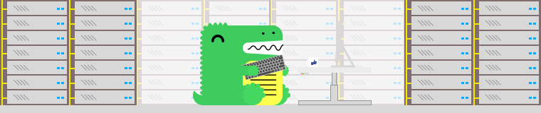

<em> AluraChallenge </em>
<h1 align="center"> Bienvenida </h1>

<h1 align="center"> Comandos más utilizados Git </h1>

# git
git init
git status
git add -A
git add archivo.html

git commit -am "comentario"

git remote add origin -gitlink-

# comprobando
git remote
rpta -> origin

# subiendo, fuerza y chanca, pese a estar vacios
git push origin master --force

#bajando
git fetch --gitlink--
git pull --gitlink--

